# Configure Apache As A Load Balancer

1. Create an Ubuntu Server 20.04 EC2 instance and name it Project-8-apache-lb
`ssh -i "Apa-key.pem" ubuntu@ec2-15-229-10-7.sa-east-1.compute.amazonaws.com`

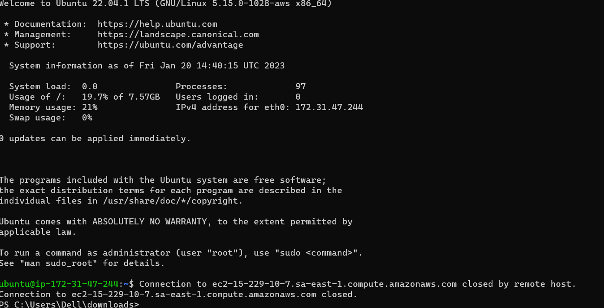

2. Open TCP port 80 on Project-8-apache-lb
3. 
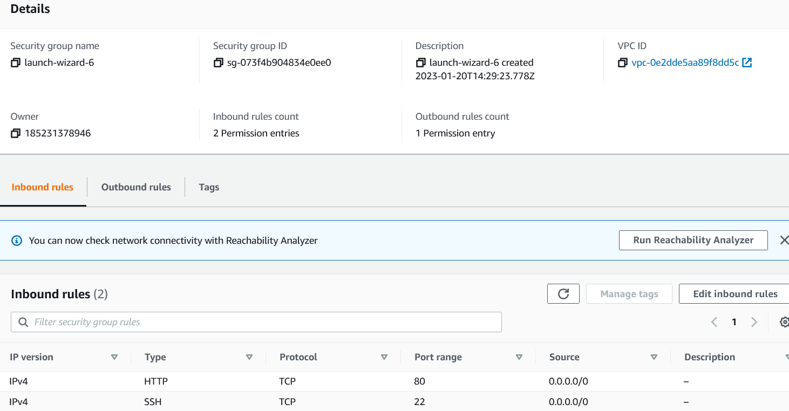

3. Install Apache Load Balancer on Project-8-apache-lb server and configure it to point traffic coming to LB to both Web Servers:

- Install apache2
`sudo apt update`

`sudo apt install apache2 -y`

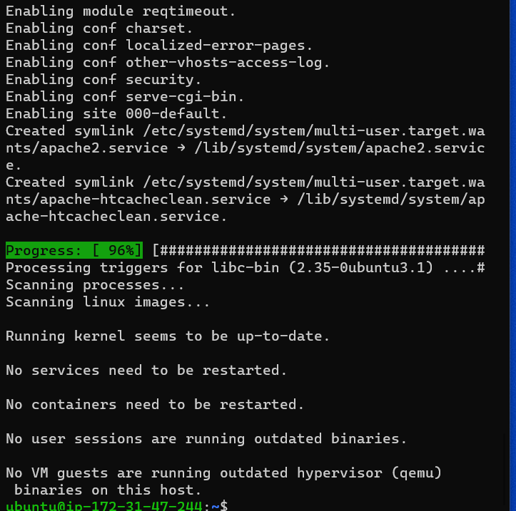

`sudo apt-get install libxml2-dev`

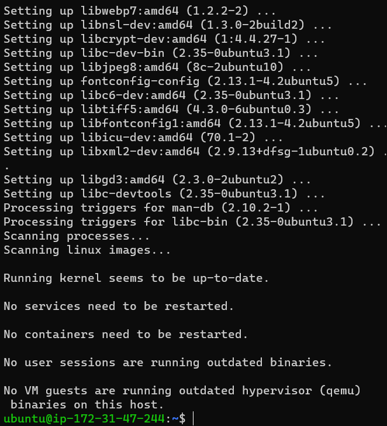

** Run 
`sudo systemctl restart apache2`

- Enable following modules:
`sudo a2enmod rewrite`

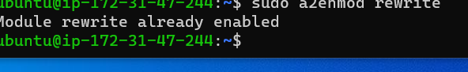

`sudo a2enmod proxy`

`sudo a2enmod proxy_balancer`

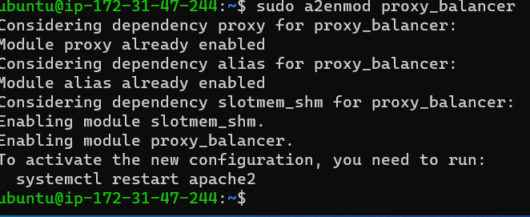

-Run
`sudo systemctl restart apache2`
`sudo a2enmod proxy_http`

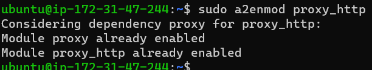

-Run
`sudo systemctl restart apache2`
`sudo a2enmod headers`

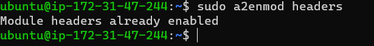

-Run
`sudo systemctl restart apache2`
`sudo a2enmod lbmethod_bytraffic`

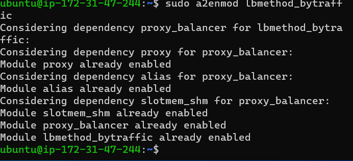

-Restart apache2 service
`sudo systemctl restart apache2`

**Make sure apache2 is up and running**

`sudo systemctl status apache2`

**Configure load balancing**

`sudo vi /etc/apache2/sites-available/000-default.conf`
Webserver1:172.31.40.198
Webserver2:172.31.42.127

### Add this configuration into this section <VirtualHost *:80>  </VirtualHost>

<Proxy "balancer://mycluster">
               BalancerMember http://172.31.40.198:80 loadfactor=5 timeout=1
               BalancerMember http://172.31.42.127:80 loadfactor=5 timeout=1
               ProxySet lbmethod=bytraffic
               # ProxySet lbmethod=byrequests
        </Proxy>

        ProxyPreserveHost On
        ProxyPass / balancer://mycluster/
        ProxyPassReverse / balancer://mycluster/

-Restart apache server

`sudo systemctl restart apache2`

4. Verify that our configuration works – try to access your LB’s public IP address or Public DNS name from your browser:
`curl:http://15.228.155.255/index.php`

[Project Load balance site](http://15.228.155.255/index.php)

Open two ssh/Putty consoles for both Web Servers and run following command:
-set inbound rule for Project8-Apaches on both Webserver1 and Webserver2

`sudo tail -f /var/log/httpd/access_log`

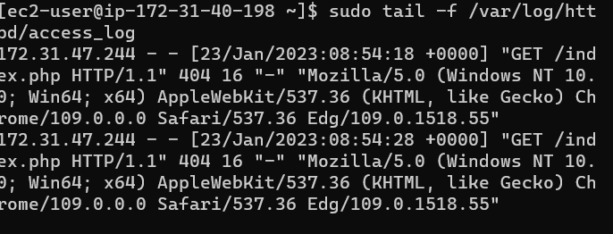

![Webserver2 tail confirmed]./Images/(tail-webserver2.png)

**Optional Step – Configure Local DNS Names Resolution**
`sudo vi /etc/hosts`

#Add 2 records into this file with Local IP address and arbitrary name for both of your Web Servers

172.31.40.198 Web1
172.31.42.127 Web2

Now you can update your LB config file with those names instead of IP addresses.
`sudo vi /etc/apache2/sites-available/000-default.conf`

BalancerMember http://Web1:80 loadfactor=5 timeout=1
BalancerMember http://Web2:80 loadfactor=5 timeout=1

You can try to curl your Web Servers from LB locally 
`curl http://Web1` 

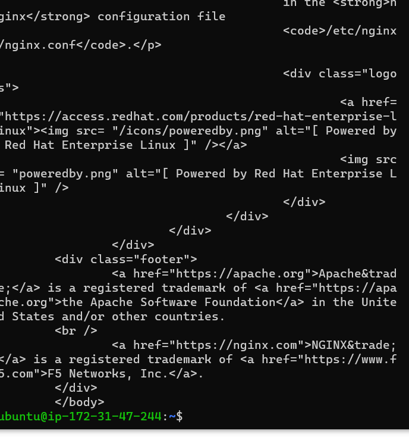

`curl http://Web2`

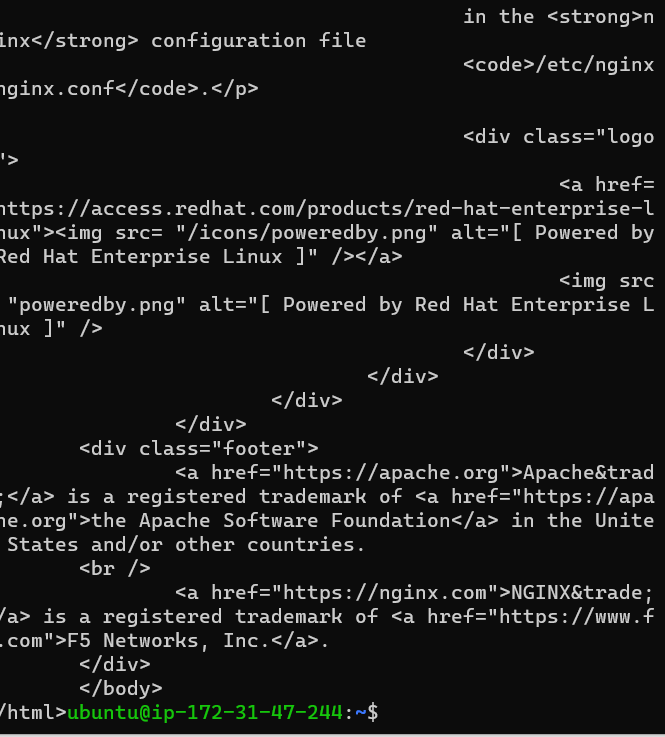
